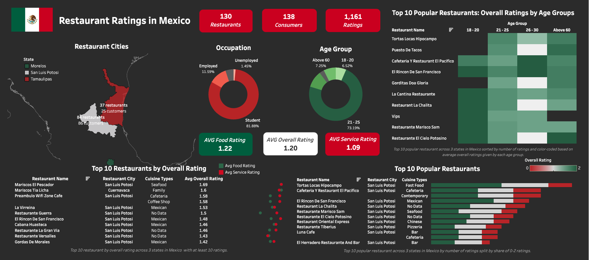
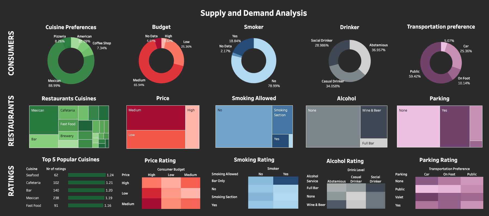

# Restaurant Ratings in Mexico

## Project Background
As a Data Analyst for GustoRatings, a consultancy agency dedicated to providing restaurant analyses for the F&B industry, I was tasked with developing an analysis on restaurant ratings in Mexico for investors planning to open restaurants in the region. 

The report uses ratings from 138 consumers and 130 restaurants across Tamaulipas, San Luis Potosi, and Morelos. Insights and recommendations are provided on the following key areas:

1. **Customer Demographics:** How do customer demographics (e.g., age, occupation, budget) influence restaurant preferences and ratings?
2. **Popular Business Model:** What cuisines and business models are most popular and highly rated across the three states?
3. **Successful Restaurant Attributes:** Which attributes—such as pricing, transportation access, or amenities—drive customer satisfaction?
4. **Supply & Demand:** Where are the gaps between customer demand and restaurant supply in the target markets?

The SQL queries used to inspect and clean the data for this analysis can be found [here](https://github.com/tructoldmethat/Mexico-Restaurant-Ratings-Report/blob/main/restaurant_ratings.sql).

An interactive Tableau dashboard used to visualize customer demographics and restaurant attributes can be found [here](https://public.tableau.com/views/RestaurantRatingsinMexico/ExecutiveSummary?:language=en-GB&:sid=&:redirect=auth&:display_count=n&:origin=viz_share_link).

---

## Data Structure & Initial Checks
The database consists of 5 tables with the following descriptions:

- **Ratings:** 1,162 rows, each containing the overall rating, food rating, and service rating of a consumer for a restaurant.
- **Consumers:** 139 rows, detailing consumer demographics such as age, marital status, location, smoking and alcohol preferences, and transportation methods.
- **Consumer Preferences:** 331 rows, listing preferred cuisines for each consumer.
- **Restaurants:** 131 rows, detailing restaurant attributes like location, price, franchise status, area, parking availability, alcohol service, and smoking allowance.
- **Restaurant Cuisines:** 131 rows, specifying cuisine types offered by restaurants.

  

---

## Executive Summary

### Overview of Findings
The analysis revealed that Mexican cuisine dominates consumer preferences, with affordability and casual dining being key factors driving popularity. However, oversaturation in Mexican cuisine highlights opportunities in niche options like seafood. Younger consumers (ages 21–25) represent the largest demographic, favoring restaurants offering alcohol and social spaces. Significant opportunities exist in addressing unmet demand for diverse cuisines and improved parking facilities across Tamaulipas, San Luis Potosi, and Morelos.

---

## Insights Deep Dive

### 1. Customer Demographics

- **Age and Preferences:**
  - **73.19%** of consumers are aged 21–25, drawn toward casual dining with low to medium price points.
  - Nearly **63%** are social or casual drinkers and the majority are non-smokers, favoring cuisines like Mexican, Pizzeria, American, and coffee shops.
    
 

- **Occupation and Budget:**
  - Students account for **81.88%** of customers, while only **11.59%** are employed.
  - High-budget consumers are marginal (**3.62%**), reflecting a price-sensitive market favoring budget-friendly options.

- **Transportation Preferences:**
  - Most consumers use public transportation (**59.42%**), followed by cars (**25.36%**) and walking (**10.14%**).

- **Smoking and Drinking Habits:**
  - Non-smokers take up the majority (**78.99%**), while **two-thirds** of consumers drink alcohol, showing stronger demand for alcohol services than smoking spaces.

---

### 2. Popular Business Model

- **Mexican Cuisine:**
  - Preferred by **89%** of consumers across the three states.
  - Four of the top 10 highest-rated restaurants offer Mexican cuisine, appreciated by consumers aged 18–20 and 26–30.

- **Seafood:**
  - A niche market but highly rated (average **1.69**) with consistent food and service quality. 
  - Seafood and family-style restaurants receive the highest overall ratings despite catering to niche markets. Restaurants like Mariscos El Pescador and Mariscos Tía Licha, offering premium seafood, stand out with average ratings above 1.60, demonstrating success in meeting quality expectations.

- **Cafeterias and Coffee Shops:**
  - Dominate the mid-tier segment, catering to budget-conscious students and young professionals.
  - Cafeteria Y Restaurante El Pacífico, for example, scored high in both affordability and service quality and was appreciated across all age groups, especially 26-30, reflecting a successful low-cost business model.

- **Fast Food and Pizzerias:**
  - Popular but receive lower ratings (e.g., Pizzerias: **1.16**), indicating a need for service improvements.

---

### 3. Successful Restaurant Attributes

- **Pricing:**
  - Medium-priced restaurants are most successful, resonating with **65.94%** of customers.

- **Alcohol Service:**
  - Establishments offering full bars or wine/beer see **15% higher ratings**, especially among social and casual drinkers.

- **Parking:**
  - Restaurants with parking score **20% higher** in accessibility, particularly in Tamaulipas.

- **Other Amenities:**
  - Smoking sections and outdoor seating enhance satisfaction in niche demographics.

---

### 4. Supply & Demand

- **Cuisine Diversity:**
  - Mexican cuisine is oversaturated, while seafood and contemporary options are underrepresented but highly rated.

- **Budget Segments:**
  - High-budget restaurants face lower customer volumes, suggesting pricing mismatches.

- **Accessibility:**
  - Only **25%** of restaurants offer parking, contributing to lower ratings in urban centers.

- **Alcohol and Social Amenities:**
  - Only **50%** of restaurants offer alcohol services, leaving significant demand unmet in states like Tamaulipas.

---

## Recommendations

1. **Target Medium-Budget Consumers:**
   -  Restaurants with medium-priced offerings receive the highest ratings from the majority of consumers. Investors can consider focusing on mid-range pricing strategies to attract students and young professionals, who make up a significant portion of the customer base. 

2. **Diversify Mexican Cuisine:**
   - Mexican cuisine is highly popular, but the market is saturated. Investors should consider offering unique twists, regional specialties or creating a unique concept to stand out while maintaining a focus on quality and affordability.

3. **Improve Fast Food and Pizzerias:**
   - These business models attract a substantial customer base but tend to receive lower ratings. Improving service quality and consistency in these segments could unlock growth opportunities and increase customer loyalty.

4. **Expand High-Priced Dining:**
   - Tap into gaps in High-Priced Dining as high-priced restaurants have lower customer volumes, particularly in Morelos and Tamaulipas. Introducing premium dining experiences with an emphasis on quality and exclusivity could attract high-budget customers willing to spend more. Particularly, investors can expand Seafood and Contemporary Dining Options. Seafood restaurants, despite their niche presence, receive the highest average ratings. Expanding this segment, especially in underserved areas, could meet untapped demand. Similarly, contemporary cuisine could cater to younger, urban consumers looking for innovative dining experiences. 

5. **Enhance Accessibility and Amenities:**
   - Lack of parking is a common pain point for customers, particularly in suburban and high-density areas. Restaurants with ample parking tend to perform better. Additionally, providing amenities like outdoor seating and alcohol services can increase customer satisfaction, especially among social and casual drinkers.

---

## Assumptions and Caveats

- **Data Scope:** Ratings are based on data from [MavenAnalytics](https://mavenanalytics.io/) from 2012, which may not reflect current trends.
- **Regional Bias:** Findings assume consistency across states; local variances may affect outcomes.
- **Market Dynamics:** Economic factors (e.g., inflation) may influence pricing sensitivities over time.
- **Consumer Preferences:** Transportation and smoking preferences reflect demographic-specific trends.

---
